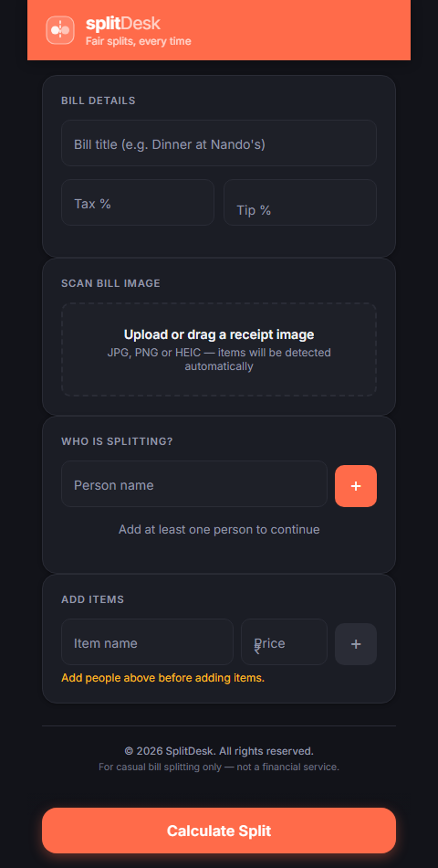
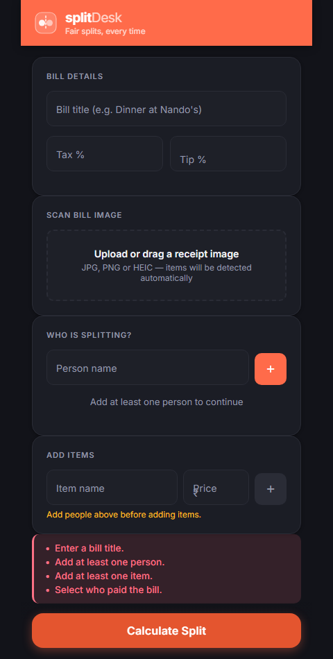
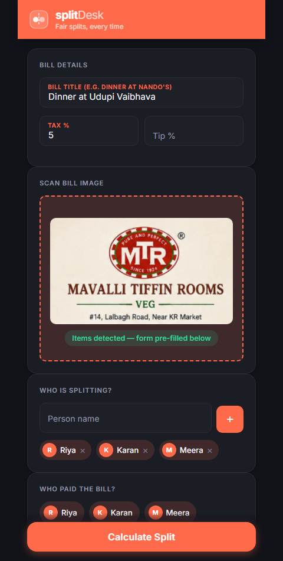
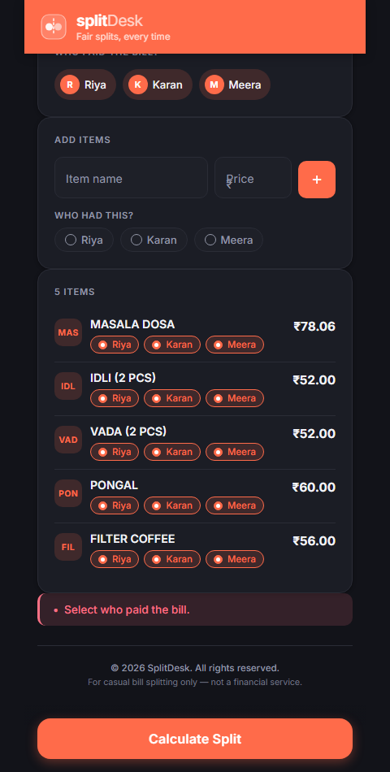
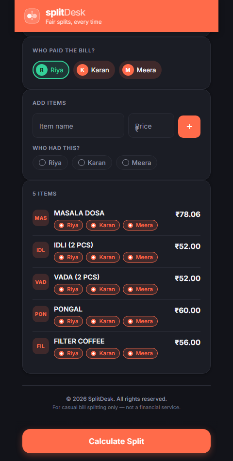
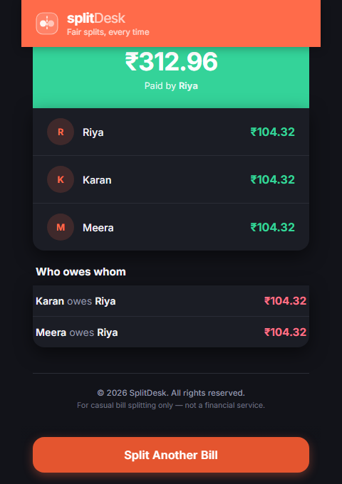

# splitDesk

> Fair bill splitting, item by item — not just an equal split.

splitDesk works out exactly who owes what based on what each person actually consumed, distributes tax and tip proportionally, and tells you who owes whom once one person has fronted the bill. It can also read a receipt photo and pre-fill items automatically via OCR.

## Screenshots

<table>
<tr>
<td width="33%"><br><b>Start a bill</b> — add a title, people, and items, or scan a receipt.</td>
<td width="33%"><br><b>Inline validation</b> — Calculate Split is always clickable; issues are called out clearly.</td>
<td width="33%"><br><b>Scan a receipt</b> — OCR reads items and prices off a real photographed bill.</td>
</tr>
<tr>
<td width="33%"><br><b>Assign consumers</b> — pick who had each item.</td>
<td width="33%"><br><b>Who paid</b> — pick who fronted the bill.</td>
<td width="33%"><br><b>Result</b> — the full split, plus a "who owes whom" settlement summary.</td>
</tr>
</table>

## Features

- **Item-level splitting** — assign each item to the people who actually consumed it; tax and tip are distributed proportionally to each person's share of the subtotal, not split evenly.
- **Receipt scanning** — upload or drag a photo of a receipt; Tesseract OCR (with image preprocessing for low-quality photos) extracts items, prices, and tax automatically.
- **Who paid / who owes whom** — mark who fronted the bill and get a settlement summary of exactly what everyone else owes them.
- **Inline validation** — the split button is never disabled; submitting an incomplete form surfaces exactly what's missing.

## Tech stack

| Layer | Technology |
|---|---|
| Frontend | React + Vite |
| Backend | ASP.NET Core Web API (.NET 8) |
| OCR | Tesseract + SixLabors.ImageSharp preprocessing |
| Testing | xUnit + Moq |
| Infrastructure | Docker Compose (nginx + API containers) |

## Quick start

```bash
docker compose up --build
```

- App: http://localhost:3000
- API: proxied through nginx at `/api/*`

## Documentation

See [docs/README.md](docs/README.md) for architecture, ADRs, and the full system design.
