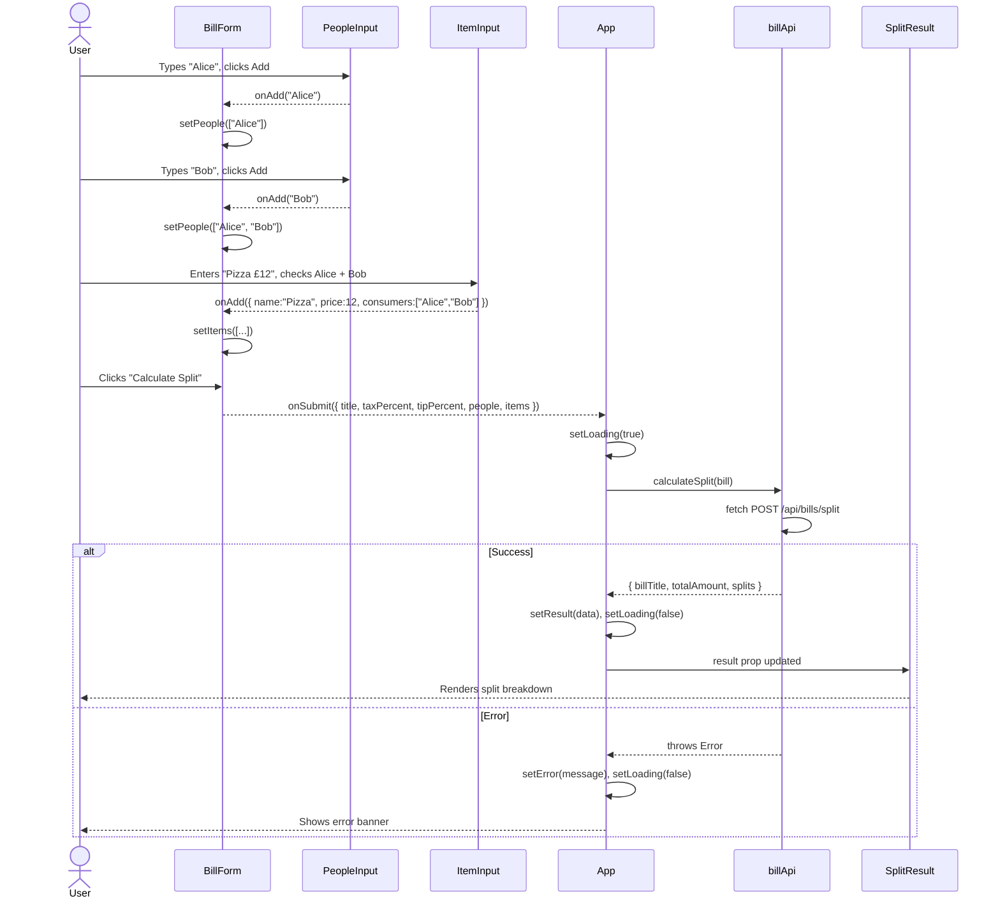
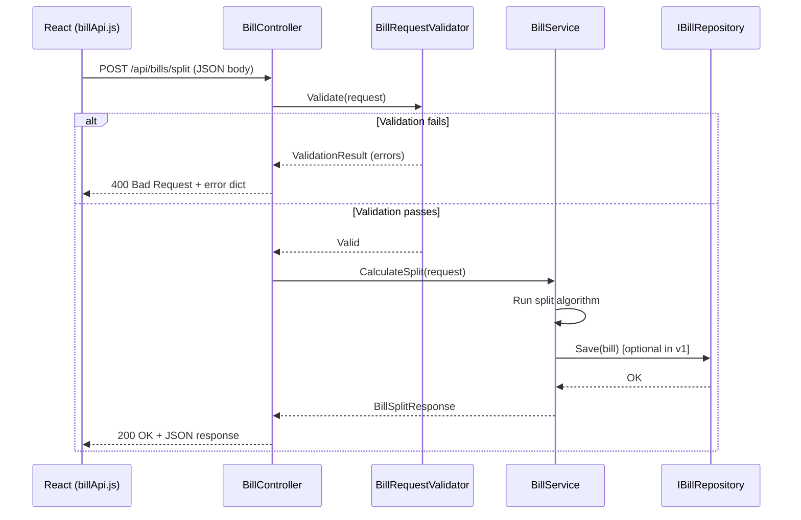
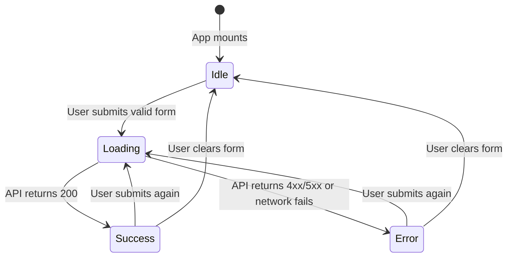
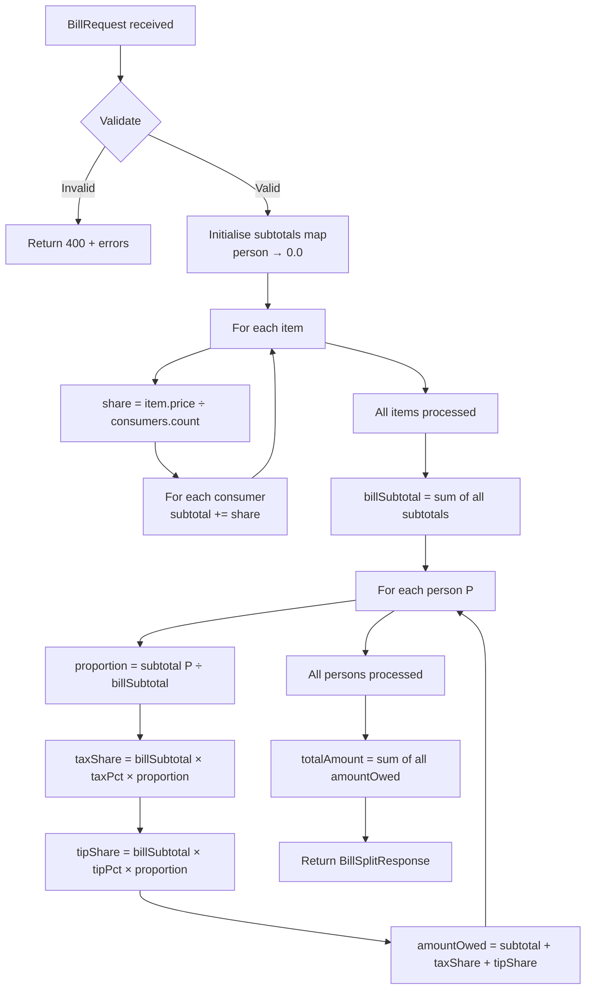
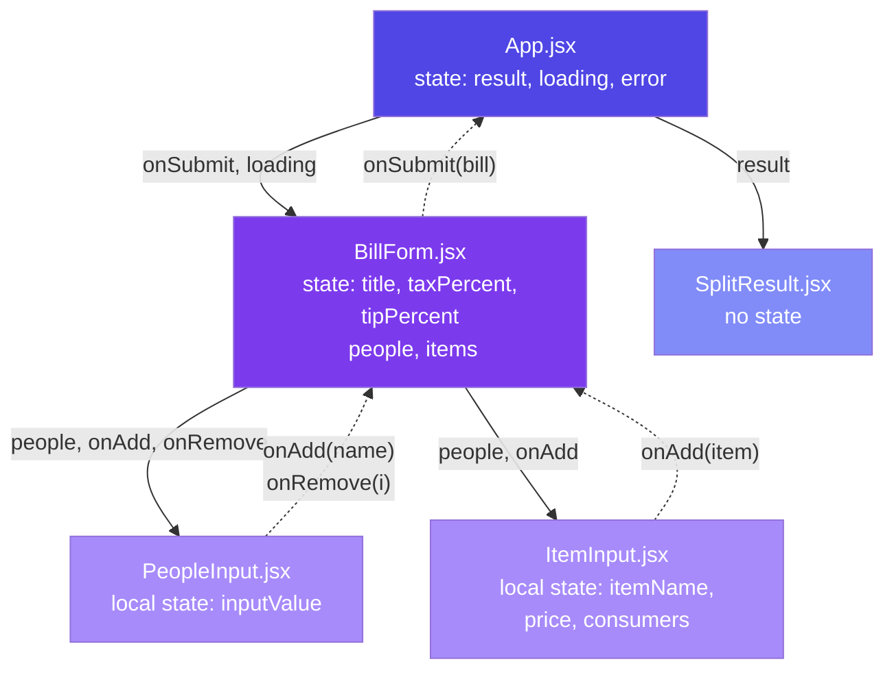

# Data Flow Diagrams — splitDesk

---

## 1. User Interaction Flow (Frontend)

---

## 2. API Request Lifecycle (Backend)

---

## 3. State Flow Diagram (React)

---

## 4. Split Algorithm Data Flow

---

## 5. Component Prop Flow

> **Solid arrows** = props flowing down.  
> **Dashed arrows** = events/callbacks bubbling up.  
> This is React's **unidirectional data flow** — data goes down, events go up.
