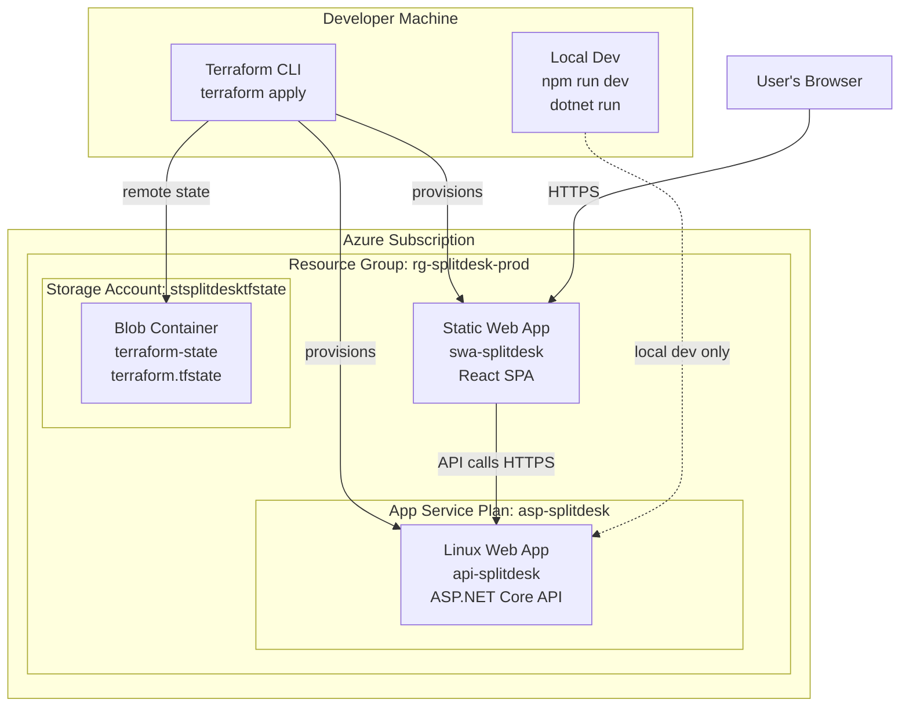
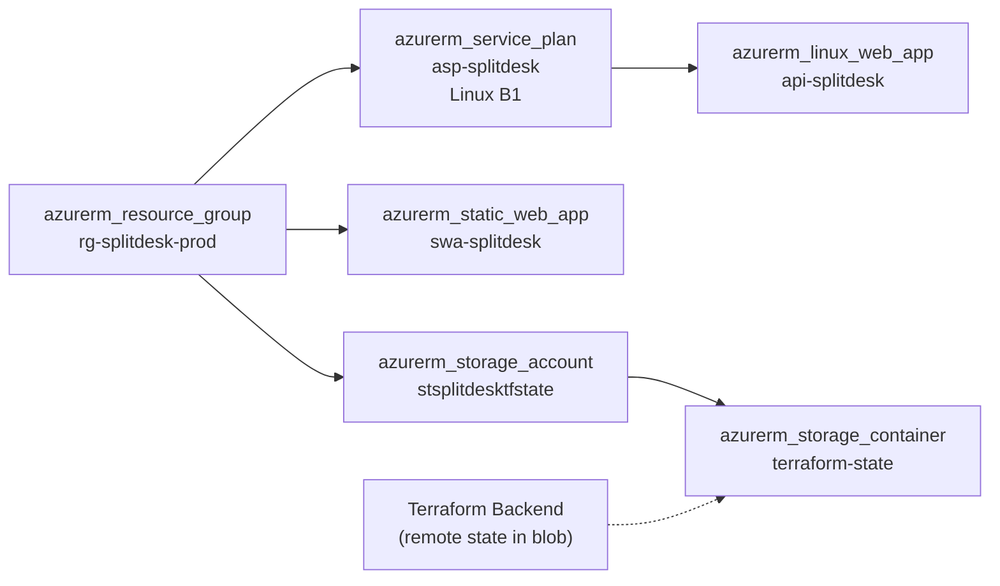
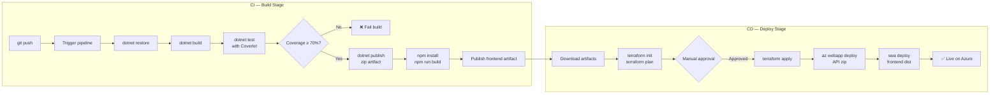

# Deployment Architecture — splitDesk

---

## Azure Infrastructure Diagram



---

## Terraform Resource Map



---

## Deployment Pipeline (Azure DevOps)



---

## Terraform File Structure

```
splitDesk/
└── infra/
    ├── main.tf          ← provider config + resource group
    ├── variables.tf     ← input variables (location, app name, SKU)
    ├── outputs.tf       ← API URL, SWA URL
    ├── backend.tf       ← remote state config (Azure Blob)
    └── modules/
        ├── app_service/
        │   ├── main.tf
        │   ├── variables.tf
        │   └── outputs.tf
        └── static_web_app/
            ├── main.tf
            ├── variables.tf
            └── outputs.tf
```

---

## Environment Variables

### Frontend (`frontend/.env.production`)

```env
VITE_API_URL=https://api-splitdesk.azurewebsites.net
```

### Backend (Azure App Service Application Settings)

| Setting | Value | Notes |
|---|---|---|
| `ASPNETCORE_ENVIRONMENT` | `Production` | Disables Swagger in prod |
| `AllowedOrigins__0` | `https://swa-splitdesk.azurestaticapps.net` | CORS — frontend origin |
| `APPLICATIONINSIGHTS_CONNECTION_STRING` | `<from Key Vault>` | Optional — telemetry |

---

## Network Flow

```
User Browser
    │
    │ HTTPS (port 443)
    ▼
Azure Static Web App (CDN-backed)
    → Serves React bundle (HTML/JS/CSS)
    │
    │ HTTPS (port 443) — API call from browser JS
    ▼
Azure App Service (Linux, .NET 8)
    → Runs ASP.NET Core process
    → Handles POST /api/bills/split
    → Returns JSON response
```

**Key point:** The browser talks to *two* Azure services — one for the static files (SWA), one for the API (App Service). The SWA does not proxy to the API; the React app calls the API directly using the `VITE_API_URL` env variable.

---

## Cost Estimate (Minimal Dev Setup)

| Resource | SKU | Est. Monthly Cost |
|---|---|---|
| App Service Plan (B1) | Basic | ~£10/month |
| Static Web App | Free tier | £0 |
| Storage Account (state) | LRS Standard | ~£0.02/month |
| **Total** | | **~£10/month** |

Run `terraform destroy` between sessions to avoid charges during development.
