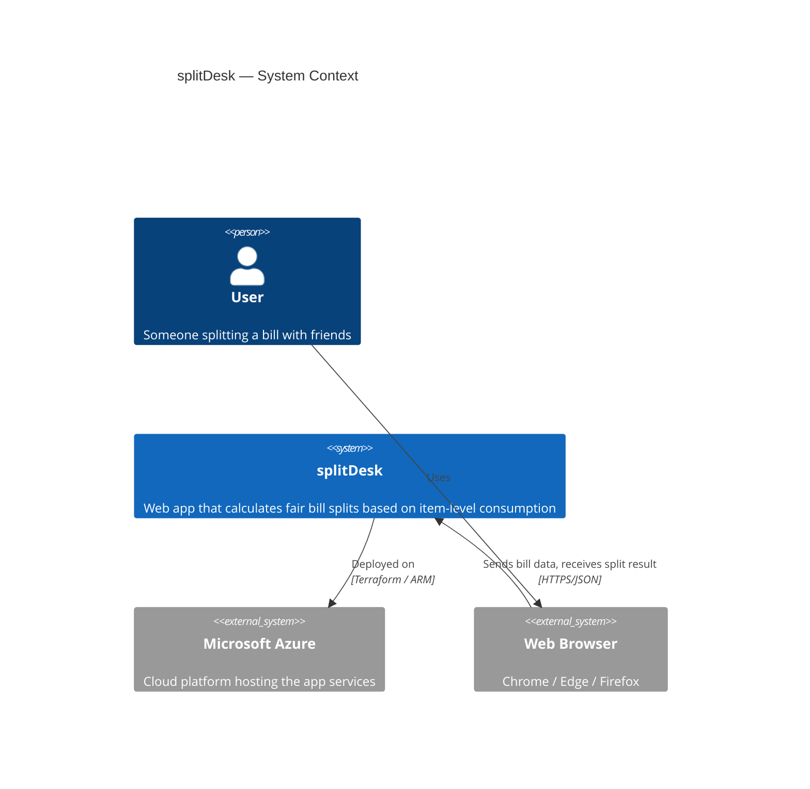
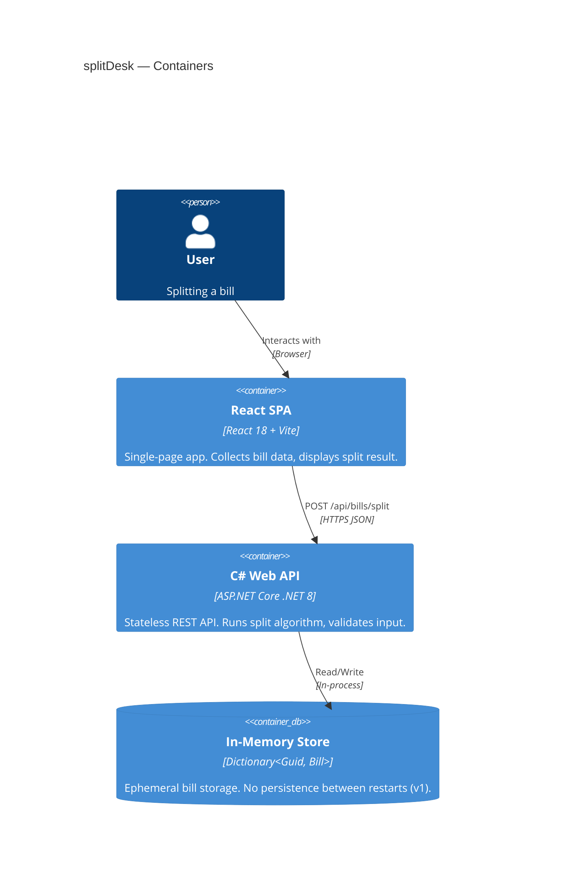
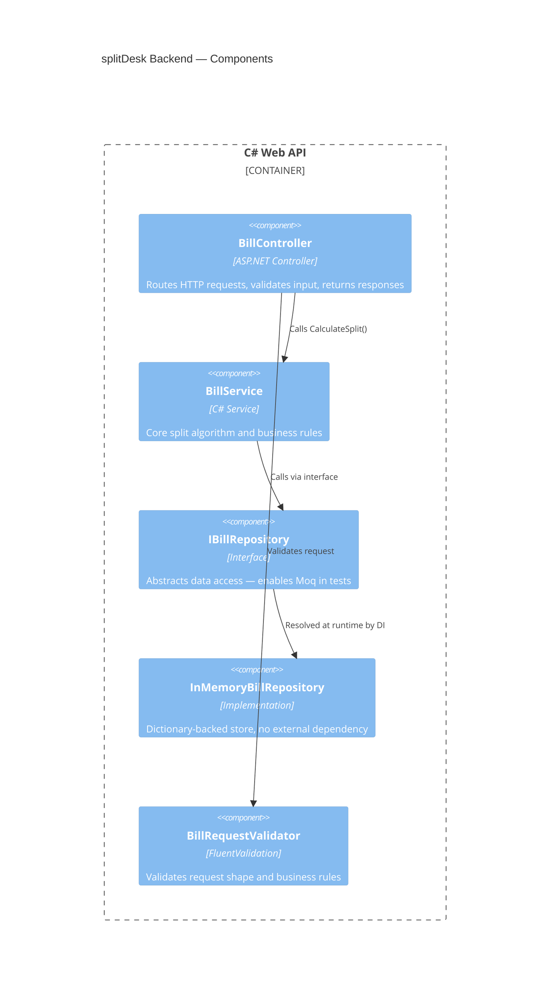
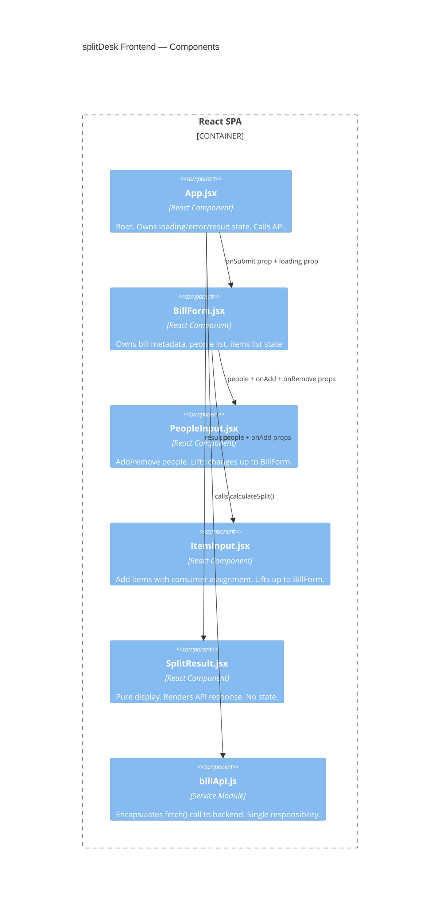
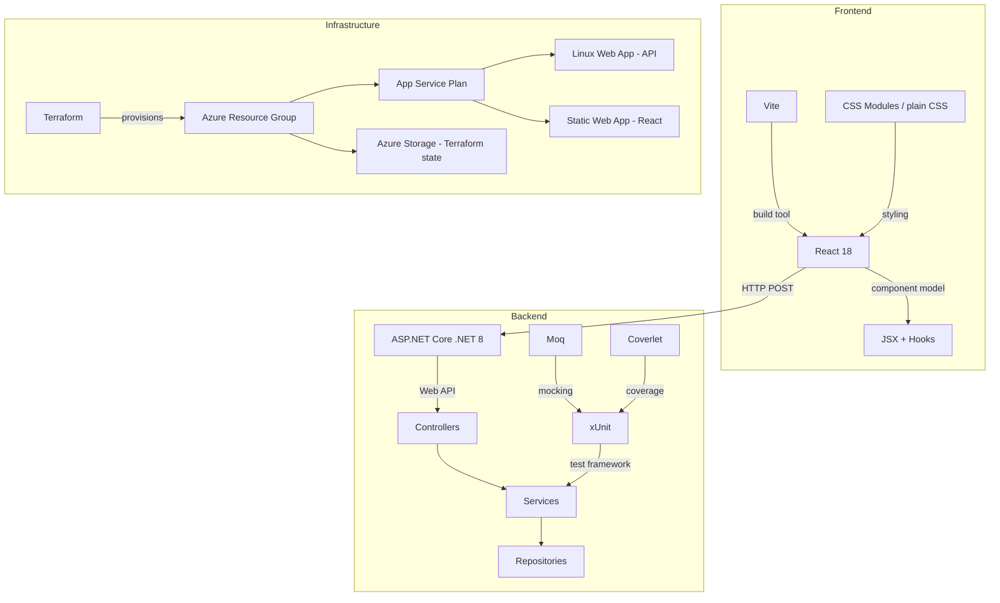

# Architecture Overview — splitDesk

> Render these diagrams in VS Code with the **Markdown Preview Mermaid Support** extension, or view on GitHub which renders Mermaid natively.

---

## C4 Level 1 — System Context

---

## C4 Level 2 — Container Diagram

---

## C4 Level 3 — Component Diagram (Backend)

---

## C4 Level 3 — Component Diagram (Frontend)

---

## Technology Decision Map

